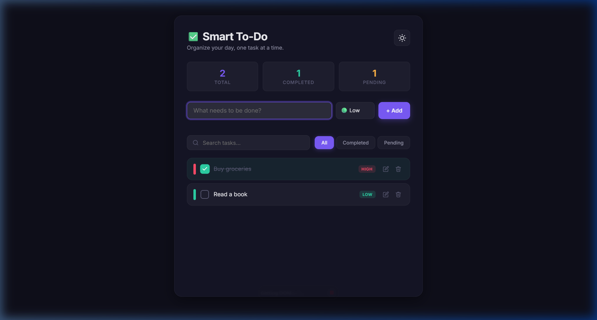
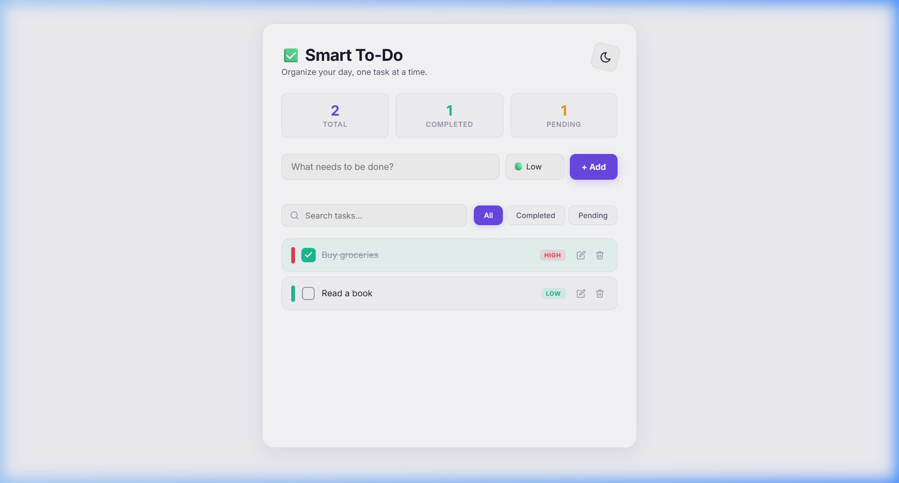

# ✅ Smart To-Do List | Task Manager

A sleek, modern **To-Do List & Task Manager** built entirely with **vanilla HTML, CSS, and JavaScript** — no frameworks, no dependencies. Features a beautiful glassmorphism UI, dark/light theme toggle, drag-and-drop reordering, priority levels, and persistent local storage.


---

## 🎯 Features

### Core Functionality

- **Add Tasks** — Quickly add new tasks with a clean input form
- **Edit Tasks** — Inline editing with Enter to save, Escape to cancel
- **Delete Tasks** — Animated removal with smooth slide-out transitions
- **Mark Complete** — Toggle task completion with a custom animated checkbox
- **Input Validation** — Visual shake animation feedback for empty submissions

### Priority System

- 🔴 **High** — Red priority indicator and badge
- 🟡 **Medium** — Orange/yellow priority indicator and badge
- 🟢 **Low** — Green priority indicator and badge

### Filtering & Search

- **Filter by status** — View All, Completed, or Pending tasks
- **Live search** — Real-time task filtering as you type
- **Stats dashboard** — Animated counters showing Total, Completed, and Pending counts

### Drag & Drop

- **Reorder tasks** — Drag and drop to rearrange task order
- **Visual feedback** — Highlight effects during drag operations
- **Persistent order** — Reordered positions are saved to localStorage

### Theming

- 🌙 **Dark mode** (default) — Deep dark palette with glassmorphism effects
- ☀️ **Light mode** — Clean, bright theme with subtle shadows
- **Theme persistence** — Your preference is saved across sessions

### UX & Animations

- **Glassmorphism** — Frosted glass background with `backdrop-filter: blur()`
- **Smooth transitions** — CSS transitions on all interactive elements
- **Slide-in/out animations** — Tasks animate in and out gracefully
- **Hover effects** — Lift, scale, and glow effects on cards and buttons
- **Responsive design** — Fully optimized for mobile, tablet, and desktop

---

## 🖼️ Screenshots

| Dark Mode                               | Light Mode                                |
| --------------------------------------- | ----------------------------------------- |
|  |  |

---

## 🚀 Getting Started

### Prerequisites

- A modern web browser (Chrome, Firefox, Safari, Edge)
- No build tools, package managers, or servers required

### Installation

1. **Clone the repository**

   ```bash
   git clone https://github.com/your-username/smart-todo-list.git
   cd smart-todo-list
   ```

2. **Open in browser**

   ```bash
   # Option 1: Simply open the file
   open index.html        # macOS
   start index.html       # Windows

   # Option 2: Use a local server (optional)
   python -m http.server 8080
   # Then visit http://localhost:8080
   ```

That's it — no `npm install`, no build step, just pure web technologies.

---

## 📁 Project Structure

```
smart-todo-list/
├── index.html      # App markup — semantic HTML5 with accessibility attributes
├── style.css       # Complete styling — theming, animations, responsive layout
├── script.js       # Application logic — CRUD, localStorage, drag-and-drop, filtering
└── README.md       # Project documentation
```

---

## 🛠️ Tech Stack

| Technology             | Purpose                                                                        |
| ---------------------- | ------------------------------------------------------------------------------ |
| **HTML5**              | Semantic structure with ARIA attributes for accessibility                      |
| **CSS3**               | Custom properties (theming), Flexbox, Grid, Keyframe animations, Glassmorphism |
| **Vanilla JavaScript** | DOM manipulation, Event handling, localStorage API, Drag & Drop API            |
| **Google Fonts**       | [Inter](https://fonts.google.com/specimen/Inter) typeface for clean typography |

---

## ⚙️ How It Works

### Data Persistence

All tasks are stored in the browser's **localStorage** as a JSON array. Each task object contains:

```json
{
  "id": 1709901234567,
  "text": "Buy groceries",
  "completed": false,
  "priority": "high"
}
```

### Architecture

- **Modular functions** — Separate, well-documented functions for each operation (CRUD, filters, theme, drag-and-drop)
- **Event-driven** — All interactions are handled via event listeners with proper delegation
- **State-based rendering** — The UI re-renders from the single source of truth (localStorage) on every change
- **XSS Protection** — User input is escaped via `escapeHTML()` before being rendered into the DOM

---

## 📱 Responsive Breakpoints

| Breakpoint | Behavior                                               |
| ---------- | ------------------------------------------------------ |
| `> 600px`  | Full horizontal layout — form inputs side by side      |
| `≤ 600px`  | Stacked form layout, centered filters, compact stats   |
| `≤ 380px`  | Subtitle and priority badges hidden for minimal layout |

---

## 🎨 Customization

### Theming

Modify CSS custom properties in `style.css` under `[data-theme="dark"]` or `[data-theme="light"]` to customize the color palette:

```css
[data-theme="dark"] {
  --accent: #7c5cfc; /* Primary accent color */
  --danger: #ff4d6a; /* Delete / error color */
  --success: #2dd4a8; /* Completed / success color */
  --bg-body: #0f0f1a; /* Page background */
  --bg-app: rgba(22, 22, 40, 0.85); /* App container */
}
```

### Priority Colors

```css
--priority-high: #ff4d6a; /* Red */
--priority-medium: #ffb347; /* Orange */
--priority-low: #2dd4a8; /* Green */
```

---

## 🤝 Contributing

Contributions are welcome! Here's how:

1. **Fork** the repository
2. **Create** a feature branch: `git checkout -b feature/my-feature`
3. **Commit** your changes: `git commit -m "Add my feature"`
4. **Push** to the branch: `git push origin feature/my-feature`
5. **Open** a Pull Request

---

## 📄 License

This project is open source and available under the [MIT License](LICENSE).

---

## 🙏 Acknowledgments

- [Inter Font](https://fonts.google.com/specimen/Inter) by Rasmus Andersson
- Inspired by modern productivity apps and glassmorphism design trends

---

<p align="center">
  Made with ❤️ using pure HTML, CSS & JavaScript
</p>
